# 无器械五分化薄肌训练指导（图文详解版 v3.0）

> 适合：居家无器械训练新手，目标打造薄肌、倒三角与均衡体态。

---

## 训练循环

肩 → 腹 → 胸 → 背 → 腿 →（休息一天，可选）→ 重复

## 核心原则

- 每个动作仅训练当前阶段，不要三个阶段一起做。
- 每组间休息2分钟。
- 动作标准优先于次数。
- 连续两次训练轻松完成目标、最后一组仍有1~2次余力、无关节疼痛即可升级阶段。
- 第三阶段完成后，通过增加次数、组数、离心速度控制或背包负重继续渐进超负荷。

---

## 训练前热身（5~8分钟）

| 顺序 | 内容 | 时间 |
|---|---|---:|
| 1 | 开合跳 | 60秒 |
| 2 | 高抬腿 | 60秒 |
| 3 | 动态拉伸 | 按训练日选择 |

| 训练日 | 动态拉伸 |
|---|---|
| 肩日 | 绕环、肩胛收缩 |
| 胸日 | 扩胸、摆臂 |
| 背日 | 猫牛式、胸椎旋转 |
| 腿日 | 深蹲热身、髋踝绕环 |
| 腹日 | 猫牛式、躯干旋转 |

---

## Day1 肩部

### 第一阶段：跪姿冲肩俯卧撑

| 项目 | 内容 |
|---|---|
| 训练量 | 8~10次 ×6组 |
| 发力 | ⭐⭐⭐⭐⭐三角肌｜⭐⭐⭐三头｜⭐⭐上胸 |
| 常见错误 | 耸肩、塌腰、手放过远 |

**动作要点**

1. 身体呈倒V。
2. 头部落向双手之间。
3. 推起呼气，核心收紧。

### 第二阶段：标准冲肩俯卧撑

| 项目 | 内容 |
|---|---|
| 训练量 | 8~10次 ×6组 |
| 发力 | ⭐⭐⭐⭐⭐三角肌 |
| 常见错误 | 下放太浅、身体晃动 |

**动作要点**

身体稳定；垂直下放；避免耸肩。

### 第三阶段：折刀俯卧撑

| 项目 | 内容 |
|---|---|
| 训练量 | 8~10次 ×6组 |
| 发力 | ⭐⭐⭐⭐⭐三角肌｜⭐⭐⭐⭐上胸 |
| 常见错误 | 探头、塌腰 |

**动作要点**

保持倒V；缓慢下放；控制节奏。

---

## Day2 腹部

### 第一阶段：平板支撑

| 项目 | 内容 |
|---|---|
| 训练量 | 60秒 ×8组 |
| 发力 | ⭐⭐⭐⭐⭐核心 |
| 常见错误 | 塌腰、撅臀 |

**动作要点**

身体一条直线；收腹收臀；均匀呼吸。

### 第二阶段：西西里卷腹

| 项目 | 内容 |
|---|---|
| 训练量 | 15次 ×5组 |
| 发力 | ⭐⭐⭐⭐⭐上腹 |
| 常见错误 | 借惯性 |

**动作要点**

腹部卷起；不过度拉脖子；缓慢下放。

### 第三阶段：俯身开合跳

| 项目 | 内容 |
|---|---|
| 训练量 | 12次 ×5组 |
| 发力 | 核心+心肺 |
| 常见错误 | 膝盖内扣 |

**动作要点**

轻盈落地；保持核心；连续完成。

---

## Day3 胸部

### 第一阶段：跪姿俯卧撑

| 项目 | 内容 |
|---|---|
| 训练量 | 12次 ×8组 |
| 发力 | ⭐⭐⭐⭐⭐胸大肌 |
| 常见错误 | 塌腰 |

**动作要点**

身体保持直线；胸部接近地面；推起不锁肘。

### 第二阶段：标准俯卧撑

| 项目 | 内容 |
|---|---|
| 训练量 | 12次 ×8组 |
| 发力 | 胸大肌、三头、肩前束 |
| 常见错误 | 肘外张90° |

**动作要点**

肘约45°；胸主动发力；全程控制。

### 第三阶段：下斜俯卧撑

| 项目 | 内容 |
|---|---|
| 训练量 | 10~12次 ×8组 |
| 发力 | 上胸 |
| 常见错误 | 臀部下沉 |

**动作要点**

双脚抬高；身体笔直；缓慢下放。

> **参考教学：** [NASM - Decline Push-Up](https://www.nasm.org/resource-center/exercise-library/decline-push-up) / [Decline Push-Up 视频](https://www.youtube.com/watch?v=DBz85WuXqMk)

---

## Day4 背部

### 第一阶段：门框划船

| 项目 | 内容 |
|---|---|
| 训练量 | 8~10次 ×6组 |
| 发力 | 背阔肌、菱形肌 |
| 常见错误 | 耸肩、只拉手 |

**动作要点**

夹肩胛；胸向前；身体保持直线。

> **参考教学：** [Lift Manual - Bodyweight Row in Doorway](https://liftmanual.com/bodyweight-row-in-doorway/)

### 第二阶段：毛巾划船

| 项目 | 内容 |
|---|---|
| 训练量 | 8~12次 ×6组 |
| 发力 | 背阔肌、二头 |
| 常见错误 | 身体借力 |

**动作要点**

双肘贴身；顶峰停1秒；慢放。

> **参考教学：** [SELF - Inverted Row 居家替代：可用毛巾、桌子、门框等完成](https://www.self.com/story/how-to-do-inverted-row)

### 第三阶段：反向划船/引体向上

| 项目 | 内容 |
|---|---|
| 训练量 | 接近力竭 ×6组 |
| 发力 | 背阔肌、菱形肌、二头 |
| 常见错误 | 摆腿、耸肩 |

**动作要点**

先沉肩；胸靠近横杆；缓慢下降。

> **参考教学：** [SELF - Inverted Row](https://www.self.com/story/how-to-do-inverted-row) / [Martin Koban - Klimmzüge/引体向上](https://martinkoban.com/de/knieschmerzen-fitness-uebungen/)

---

## Day5 腿部

### 第一阶段：徒手深蹲

| 项目 | 内容 |
|---|---|
| 训练量 | 15次 ×6组 |
| 发力 | 股四头、臀肌 |
| 常见错误 | 驼背、膝内扣 |

**动作要点**

臀向后坐；脚跟发力；膝盖朝脚尖。

> **参考教学：** [SELF - Squat](https://www.self.com/story/8-strength-exercises) / [Health - Leg Exercises: Squat](https://www.health.com/leg-exercises-11727862)

### 第二阶段：保加利亚分腿蹲

| 项目 | 内容 |
|---|---|
| 训练量 | 每侧10次 ×6组 |
| 发力 | 股四头、臀肌 |
| 常见错误 | 左右晃动 |

**动作要点**

身体直立；前脚发力；保持平衡。

> **参考教学：** [SELF - Bulgarian Split Squat](https://www.self.com/story/how-to-do-bulgarian-split-squats) / [Health - Bulgarian Split Squat](https://www.health.com/leg-exercises-11727862)

### 第三阶段：辅助单腿深蹲/跳跃深蹲

| 项目 | 内容 |
|---|---|
| 训练量 | 每侧8~10次 ×6组 |
| 发力 | 股四头、臀肌、爆发力 |
| 常见错误 | 落地过重 |

**动作要点**

稳定膝盖；轻柔落地；控制动作。

> **参考教学：** [SELF - Jump Squat to Skater](https://www.self.com/story/full-body-strength-push) / [Health - Pistol Squat/单腿深蹲说明](https://www.health.com/pistol-squats-7553114)

### 提踵

| 项目 | 内容 |
|---|---|
| 训练量 | 20次 ×5组 |
| 发力 | 小腿 |

**动作要点**

踮到最高；顶峰停1秒；缓慢下降。

> **参考教学：** [Real Simple - Calf Raises](https://www.realsimple.com/calf-raises-8403591) / [Health - Leg Exercises: Calf Raise](https://www.health.com/leg-exercises-11727862)

---

## 手臂说明

无需单独手臂日：

- 二头：划船、引体已充分刺激。
- 三头：各类俯卧撑已充分刺激。
- 如3个月后仍偏弱，可增加椅子臂屈伸12~15次×4组。

---

## 训练后拉伸（5~8分钟）

每个动作20~30秒：

| 部位 | 拉伸动作 |
|---|---|
| 肩 | 三角肌、肩后束、胸部 |
| 胸 | 门框拉胸 |
| 背 | 婴儿式、猫牛式、背阔肌拉伸 |
| 腿 | 股四头、臀、小腿、腘绳肌 |
| 腹 | 眼镜蛇式、猫牛式 |

### 三角肌拉伸

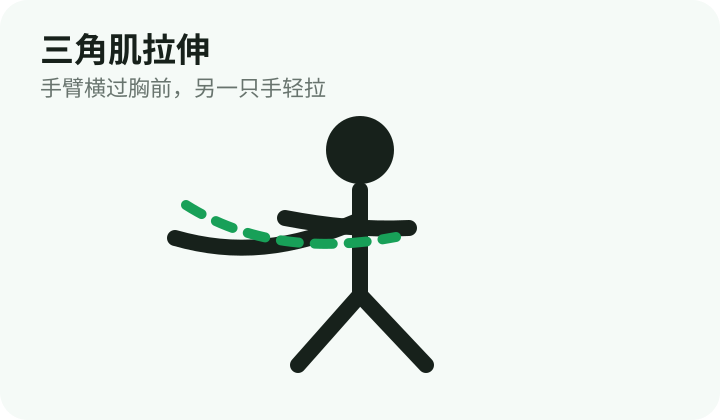

> **视频指导：** [三角肌拉伸视频](https://www.youtube.com/results?search_query=deltoid+shoulder+stretch+video)

### 肩后束拉伸

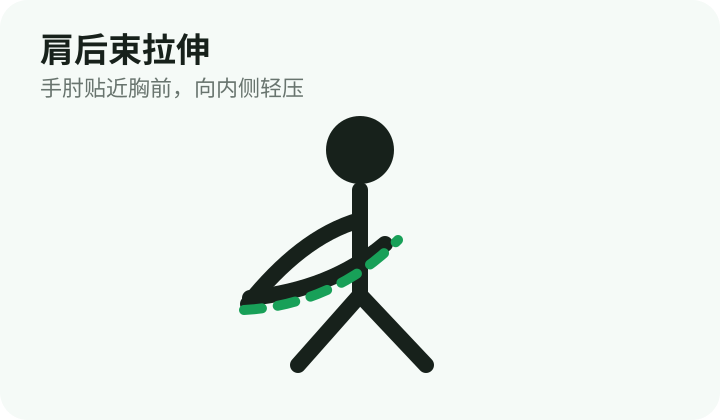

> **视频指导：** [肩后束拉伸视频](https://www.youtube.com/results?search_query=rear+delt+stretch+video)

### 门框拉胸

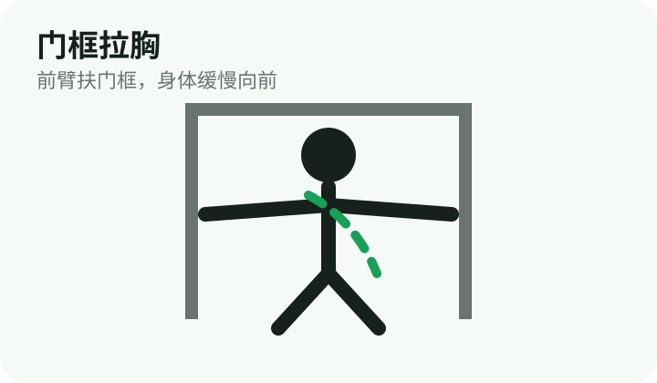

> **视频指导：** [门框拉胸视频](https://www.youtube.com/results?search_query=doorway+chest+stretch+video)

### 婴儿式

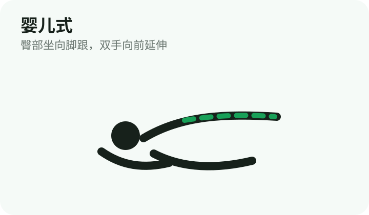

> **视频指导：** [婴儿式视频](https://www.youtube.com/results?search_query=child+pose+stretch+video)

### 猫牛式

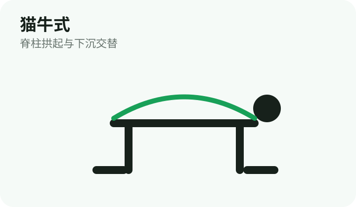

> **视频指导：** [猫牛式视频](https://www.youtube.com/results?search_query=cat+cow+stretch+video)

### 背阔肌拉伸

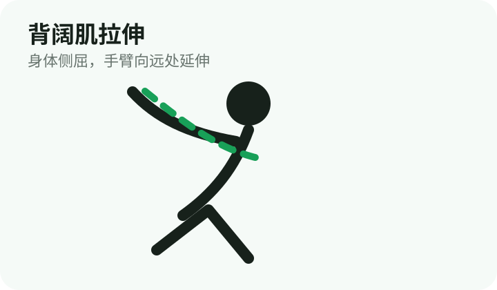

> **视频指导：** [背阔肌拉伸视频](https://www.youtube.com/results?search_query=lat+stretch+video)

### 股四头肌拉伸

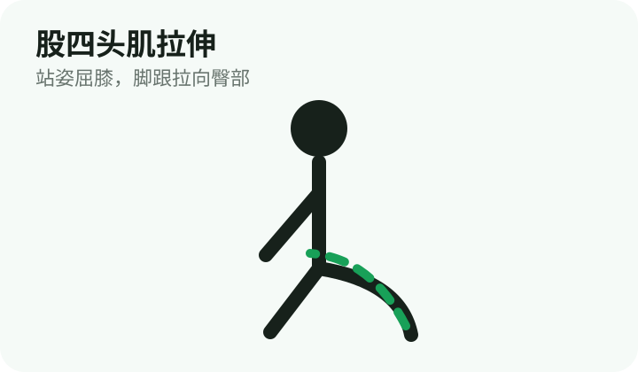

> **视频指导：** [股四头肌拉伸视频](https://www.youtube.com/results?search_query=quad+stretch+video)

### 臀部拉伸

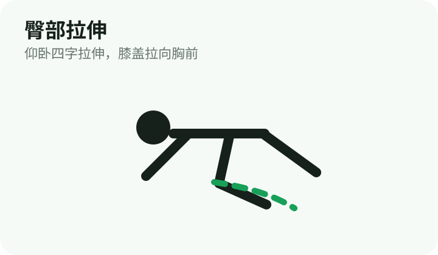

> **视频指导：** [臀部拉伸视频](https://www.youtube.com/results?search_query=glute+stretch+video)

### 小腿拉伸

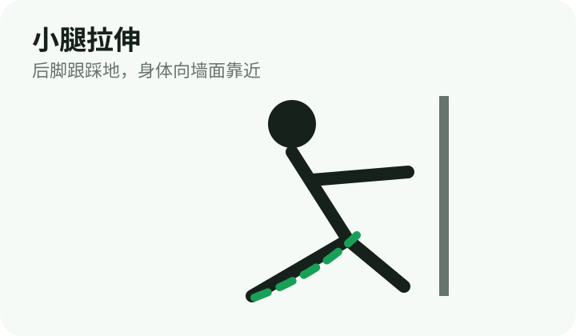

> **视频指导：** [小腿拉伸视频](https://www.youtube.com/results?search_query=calf+stretch+video)

### 腘绳肌拉伸

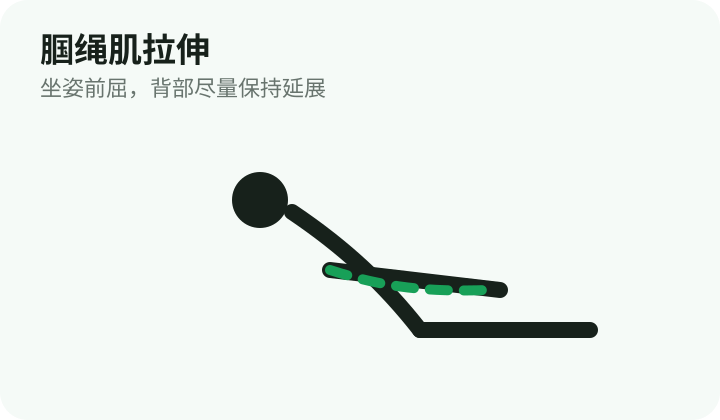

> **视频指导：** [腘绳肌拉伸视频](https://www.youtube.com/results?search_query=hamstring+stretch+video)

### 眼镜蛇式

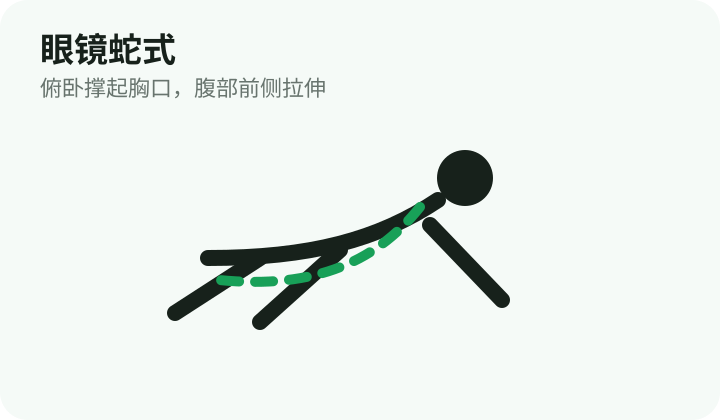

> **视频指导：** [眼镜蛇式视频](https://www.youtube.com/results?search_query=cobra+stretch+video)

---

## 饮食建议

- 蛋白质：1.6~2.0g/kg体重
- 睡眠：7~9小时
- 饮水：2~3L/天
- 增肌：轻微热量盈余
- 减脂：轻微热量缺口

> 坚持训练比频繁更换计划更重要。
